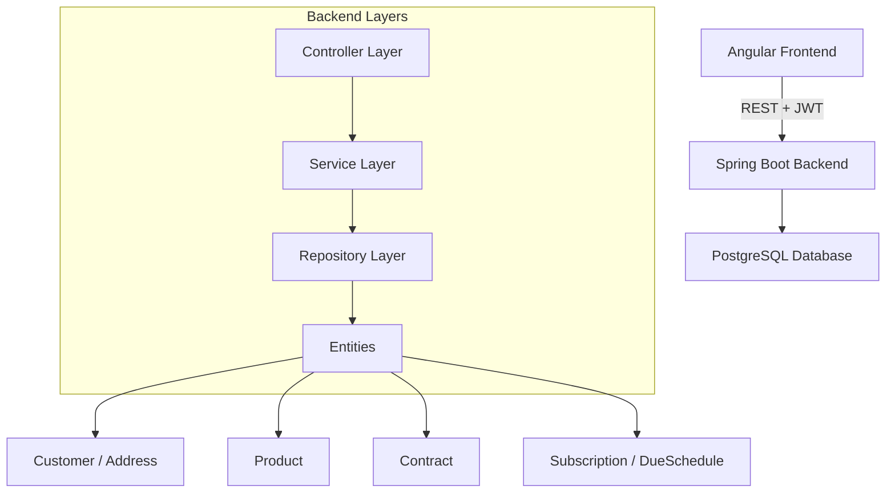

# ERP System – Fullstack mit Spring Boot & Angular

Ein **ERP-System** zur Verwaltung von Kunden, Adressen, Produkten, Verträgen, Abonnements und Fälligkeitsplänen.  
Fullstack-Anwendung mit **Spring Boot (Java)**, **Angular (TypeScript)**, **PostgreSQL** und **JWT-Authentifizierung**.  

---

## ✨ Features

- Authentifizierung & Autorisierung mit JWT (Login/Register)
- Kunden- und Adressverwaltung (CRUD)
- Produktverwaltung (CRUD)
- Vertragsverwaltung inkl. Abos & DueSchedules
- Geschäftslogik: Kunde kann nicht gelöscht werden, wenn aktive Verträge bestehen
- Swagger API-Dokumentation

---

## 🏗️ Architektur



---

## 📂 Projektstruktur

```
erp-system-backend/
├── .idea/
├── .mvn/wrapper/
├── logs/
├── src/
│   ├── main/
│   │   ├── java/com/erp/backend/
│   │   │   ├── adapter/
│   │   │   ├── config/
│   │   │   ├── controller/
│   │   │   ├── domain/
│   │   │   ├── dto/
│   │   │   ├── entity/
│   │   │   ├── event/
│   │   │   ├── exception/
│   │   │   ├── mapper/
│   │   │   ├── repository/
│   │   │   └── service/
│   │   │       └── event/
│   │   └── resources/
│   └── test/java/com/erp/backend/
│       ├── controller/
│       └── service/
└── target/
```

---

## 🚀 Quickstart

### Voraussetzungen

- **Java 21**
- **Maven 3.9+**
- **PostgreSQL** Datenbank
- **Node.js + Angular CLI** (für das Frontend, falls verwendet)

### Backend starten

1. **PostgreSQL-Datenbank** erstellen (z. B. `erp_db`)

2. In `src/main/resources/application.properties` **DB-Verbindung** konfigurieren:
   ```properties
   spring.datasource.url=jdbc:postgresql://localhost:5432/erp_db
   spring.datasource.username=dein_user
   spring.datasource.password=dein_passwort
   spring.jpa.hibernate.ddl-auto=update
   spring.jpa.show-sql=true
   ```

3. **Backend starten**:
   ```bash
   mvn spring-boot:run
   ```
   oder in der IDE (z. B. IntelliJ) die Hauptklasse starten.

4. **Backend läuft unter**: http://localhost:8080
5. **Swagger UI**: http://localhost:8080/swagger-ui.html

### Frontend starten

1. In den frontend-Ordner wechseln:
   ```bash
   cd frontend
   npm install
   ng serve
   ```

2. **Frontend läuft unter**: http://localhost:4200

---

## 🔑 Authentifizierung

- **Login/Register** über REST-API
- Nach erfolgreichem Login wird ein **JWT-Token** zurückgegeben
- Für geschützte Endpunkte muss der Token im Header mitgeschickt werden:
  ```
  Authorization: Bearer <token>
  ```

---

## 📜 Lizenz

Dieses Projekt steht unter der [MIT-Lizenz](LICENSE).
