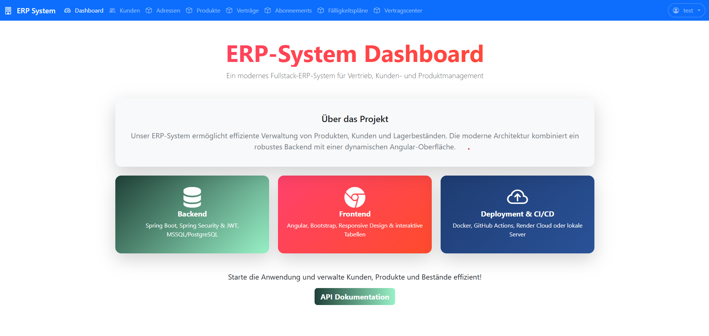
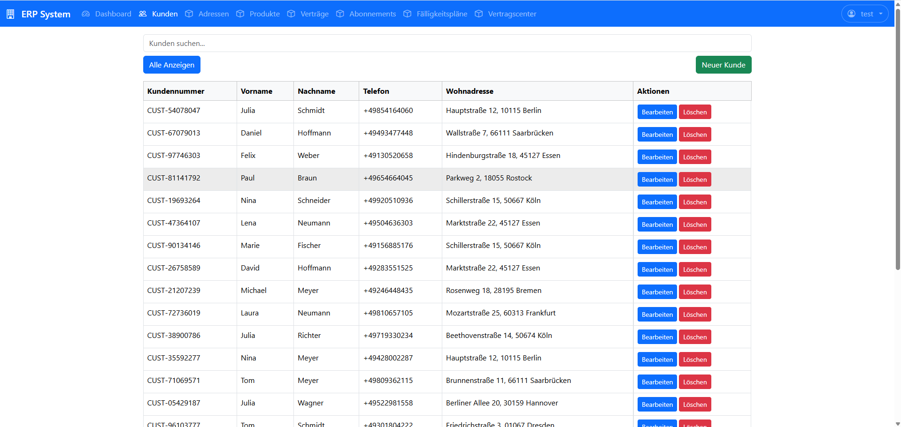
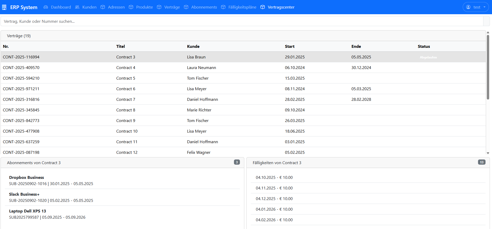

# ERP System – Fullstack Web Application

Produktionsnahes **ERP-System** zur Verwaltung von Kunden, Produkten, Verträgen
und Abonnements inkl. Zahlungslogik.

**Tech Stack:** Java · Spring Boot · Spring Security (JWT) · Angular 20 · PostgreSQL · Docker


# 🎯 Live Demo & Code

🌐 **[Live Demo](https://erp-system-frontend-tan.vercel.app/)** - Vercel Deployment  
📚 **[API Dokumentation](https://erp-system-backend-yo8w.onrender.com/swagger-ui/index.html)** - Interaktive Swagger UI

> **Demo Login:** `a` / `a` 
>
> 


---

### Kernnfunktionen
- **🔐 JWT Authentifizierung** - Sicheres Login/Register mit Token-Management
- **👥 Kundenverwaltung** - Erstellen, Lesen, Bearbeiten, Löschen mit Adressverknüpfung
- **📦 Produktkatalog** - Dynamische Produktverwaltung mit Kategorien  
- **📋 Vertragssystem** - Verknüpfung von Kunden und Produkten mit Abo-Logik
- **⏰ Fälligkeitspläne** - Automatische Generierung von Zahlungsplänen
- **🛡️ Geschäftsvalidierung** - Verhindert Löschen von Kunden mit aktiven Verträgen
- **📖 REST API** - OpenAPI/Swagger Dokumentation
- **📱 Responsive UI** - Mobile-first Bootstrap 5 Design

---

## 🏗️ Architektur
- **Controller – Service – Repository** Trennung
- **DTO Pattern** für API-Schichten
- **Service Layer** für Geschäftslogik
- **Sauberes Domänenmodell**
  (Customer → Contract → Subscription → PaymentSchedule)


---


## 📸 Anwendungs-Screenshots

### Dashboard & Navigation

*Saubere Angular 20 Oberfläche mit Bootstrap 5 Styling*

### Kundenverwaltung  
 
*Vollständige CRUD-Operationen mit Formular-Validierung*

### Vertragssystem

*Geschäftslogik: Kunden mit aktiven Verträgen können nicht gelöscht werden*

---

## 🚀 Deployment & CI/CD

- **Backend:** Render
- **Node.js 18+** Vercel
- **Automatisches Deployment** bei Push auf main

```bash
git push origin main
# → Backend & Frontend werden automatisch deployed
```

---


## 🛠️ Lokale Entwicklung

### Voraussetzungen
- **Java 21**
- **Node.js 18+**
- **PostgreSQL**

### Start
```bash
# Backend
./mvnw spring-boot:run

# Frontend
cd frontend
npm install
ng serve
```
- **Frontend: http://localhost:4200**
- **Backend: http://localhost:8080**
- **Swagger: http://localhost:8080/swagger-ui.html**

---

## 🧭 Roadmap

- **📄 Rechnungsgenerierung** - PDF-Erstellung aus Verträgen
- **🔄 Batch-Verarbeitung** - Monatliche Abrechnungsautomatisierung  
- **📊 Basis-Analytics** - Kunden- und Umsatzmetriken
- **🧪 Test-Suite** - Unit- und Integrationstests
- **📝 Audit-Logging** - Verfolgung von Benutzeraktionen für Compliance


---

## 📜 Lizenz

Dieses Projekt ist **nicht frei verwendbar**.

- Nutzung ausschließlich zu Lern- und Demonstrationszwecken gestattet.
- Keine kommerzielle Verwendung ohne ausdrückliche schriftliche Erlaubnis des Autors.
- Änderungen, Verbreitung oder Veröffentlichung nur mit Genehmigung.

Alle Rechte vorbehalten.

---
