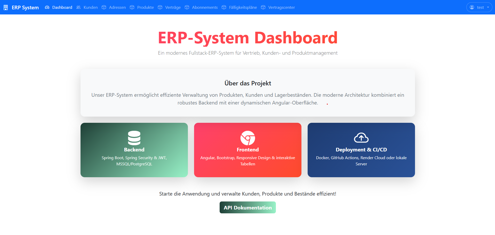
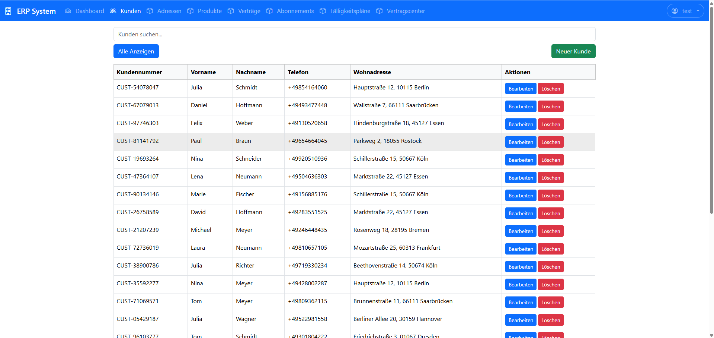
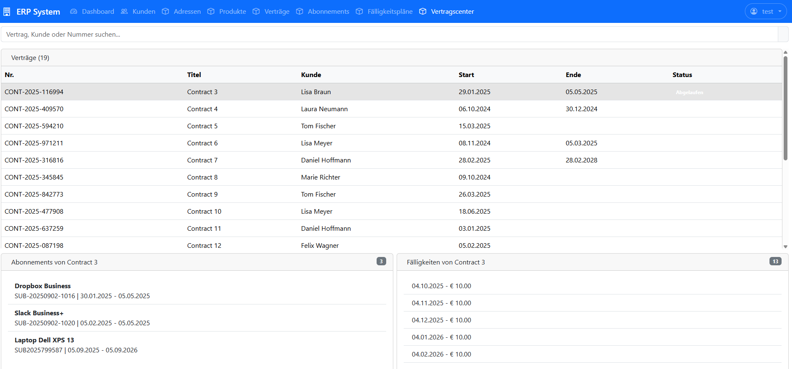

# ERP System – Backend

<p align="center">
  
  
  
  
  
  
  
</p>

<p align="center">
  <a href="https://erp-system-backend-yo8w.onrender.com/swagger-ui/index.html"><strong>📚 Live API Docs (Swagger UI)</strong></a>
  &nbsp;·&nbsp;
  <a href="https://erp-system-frontend-tan.vercel.app/"><strong>🌐 Live Demo</strong></a>
  &nbsp;·&nbsp;
  <a href="https://github.com/i-akguel03/erp-system-frontend"><strong>🖥️ Frontend Repository</strong></a>
</p>

---

Produktionsnahes **Enterprise Resource Planning System** – vollständig implementiert vom Datenbankschema bis zur REST-API-Schicht.  
Das System deckt alle typischen ERP-Domänen ab: Kundenverwaltung, Vertragswesen, automatisierte Rechnungsstellung, Forderungsmanagement, Audit-Logging und Analytics.

> **Demo Login:** `admin` / `admin`

---

## Architektur & Design-Entscheidungen

```
┌─────────────────────────────────────────────────────┐
│                  REST Controllers (18)              │
│         @RestController · @Valid · DTO-Mapping      │
├─────────────────────────────────────────────────────┤
│               Service Layer (25+)                   │
│      Geschäftslogik · @Transactional · Events       │
├─────────────────────────────────────────────────────┤
│           Repository Layer (JPA/Hibernate)          │
│       Spring Data JPA · Custom Queries · JPQL       │
├─────────────────────────────────────────────────────┤
│                  PostgreSQL 16                      │
└─────────────────────────────────────────────────────┘
```

**Technische Entscheidungen:**
- **Stateless JWT-Authentifizierung** – kein Server-Side Session State, horizontal skalierbar
- **DTO-Pattern** – strikte Trennung zwischen API-Schicht und Domänenmodell
- **Global Exception Handling** – `@ControllerAdvice` mit strukturierten Error-Response-DTOs
- **AOP-basiertes Audit-Logging** – alle schreibenden Operationen werden mit Vorher-/Nachher-Snapshot protokolliert
- **Batch-Transaktionen mit Rollback** – `@Transactional` mit definierter Rollback-Strategie für den Rechnungslauf

---

## Features

### Authentifizierung & Sicherheit
- JWT-basierte Authentifizierung (jjwt 0.11.5) mit Access-Token-Strategie
- Rollenbasierte Zugriffskontrolle (RBAC): `ROLE_USER`, `ROLE_ADMIN`
- Spring Security Filter Chain mit stateless Session Policy
- Passwort-Hashing via BCrypt
- Registrierung mit Validierung & Willkommens-E-Mail (JavaMail)

### Kundenverwaltung & CRM
- Vollständige CRUD-Operationen für Kunden und Adressen
- Adressverknüpfung mit Autovervollständigungs-Unterstützung
- Geschäftsvalidierung: Kunden mit aktiven Verträgen sind löschgeschützt
- Willkommens-E-Mail bei Neuanlage (Spring Mail / JavaMail)

### Vertrags- & Abonnementmanagement
- Vertragsverwaltung mit Laufzeiten und Statusautomatik
- Subscription-Lifecycle: `ACTIVE`, `CANCELLED`, `EXPIRED`, `SUSPENDED`
- Automatische Ablaufbenachrichtigungen per E-Mail
- Kündigungslogik mit konfigurierbaren Fristen

### Automatisierter Rechnungslauf (Batch Processing)
- Transaktionaler Batch-Rechnungslauf über alle aktiven Abonnements
- `@Transactional` mit Rollback bei Fehlern in einzelnen Positionen
- Datumsgesteuerter Lauf mit konfigurierbarem Zeitfenster
- Automatische Generierung von Fälligkeitsplänen (Due Schedules)

### Forderungsmanagement & Zahlungen
- Offene-Posten-Verwaltung mit Echtzeit-Status
- Teilzahlungen mit automatischer Restbetragsberechnung
- Aging-Analyse nach Fälligkeitsintervallen (1–30, 31–60, 61–90, >90 Tage)
- Mahnwesen mit E-Mail-Benachrichtigung und Zähler
- Zahlungserfassung mit Referenz und Zahlungsart

### Audit-Log & Compliance
- AOP-Interceptor protokolliert alle schreibenden API-Aufrufe
- Vorher-Nachher-Vergleich der Entitätszustände (JSON-Snapshot)
- Benutzeridentifikation und Zeitstempel bei jeder Änderung
- Filterbare Log-Ansicht nach Entitätstyp, Benutzer und Zeitraum

### Analytics & KPI-Dashboard
- Live-Kennzahlen: MRR (Monthly Recurring Revenue), Kundenzahl, aktive Abonnements
- Offene-Posten-Übersicht mit Gesamtbetrag und Anzahl
- Überfällige Posten mit Betrag und Zähler
- Direkt aus der Datenbank aggregiert (keine Caching-Schicht)

### Benachrichtigungssystem
- Systembenachrichtigungen mit Gelesen/Ungelesen-Status
- E-Mail-Integration für Vertragsereignisse und Zahlungserinnerungen
- Polling-fähige API für Frontend-Integration
- Ungelesen-Zähler-Endpoint für Badge-Anzeige

### Inventarverwaltung
- Produktkatalog mit Preisen, Einheiten und Typen
- Lagerbestandsverwaltung mit Bestandsführung
- Kategorisierung und Status-Management

---

## Tech Stack

| Kategorie | Technologie | Version |
|---|---|---|
| Sprache | Java | 21 |
| Framework | Spring Boot | 3.5.3 |
| Sicherheit | Spring Security + JWT | jjwt 0.11.5 |
| Persistenz | Spring Data JPA / Hibernate | 6.x |
| Datenbank | PostgreSQL | 16 |
| API-Docs | SpringDoc OpenAPI | 2.8.9 |
| Mail | Spring Mail / JavaMail | – |
| Validierung | Spring Validation (Bean Validation) | – |
| Utilities | Lombok | – |
| Konfiguration | java-dotenv | – |
| Testing | JUnit 5, Testcontainers, H2 | – |
| Containerisierung | Docker | – |
| Deployment | Render | – |

---

## REST API – Controller-Übersicht

| Controller | Endpunkte | Beschreibung |
|---|---|---|
| `AuthController` | POST /register, /login, /logout | JWT-Auth, Registrierung |
| `CustomerController` | 6 | CRUD + Suche + Adressverknüpfung |
| `AddressController` | 5 | Adressverwaltung + Autovervollständigung |
| `ProductController` | 5 | Produktkatalog + Bestandsabfrage |
| `ContractController` | 7 | Vertragsverwaltung + Statuslogik |
| `SubscriptionController` | 6 | Abonnements + Lifecycle-Management |
| `DueScheduleController` | 4 | Fälligkeitspläne + Generierung |
| `InvoiceBatchController` | 4 | Batch-Rechnungslauf + Steuerung |
| `InvoiceController` | 5 | Rechnungsverwaltung + Positionen |
| `OpenItemController` | 7 | Offene Posten + Zahlungserfassung |
| `PaymentController` | 4 | Zahlungshistorie |
| `VorgangController` | 5 | Geschäftsvorgänge + Statusverfolgung |
| `NotificationController` | 5 | Benachrichtigungen + Gelesen-Status |
| `InventoryController` | 4 | Lagerbestand |
| `DashboardController` | 1 | KPI-Aggregation |
| `AuditLogController` | 3 | Audit-Log-Abfrage |
| `UserAdminController` | 4 | Benutzerverwaltung (Admin) |
| `InitController` | 10 | Testdaten-Initialisierung (Admin) |

**Gesamt: 18 Controller · 50+ Endpunkte**

---

## Domänenmodell

```
Customer ──────── Address
    │
    └── Contract ─────── Product
            │
            └── Subscription
                    │
                    └── DueSchedule
                    │
                    └── Invoice ─── OpenItem ─── Payment
```

---

## Screenshots

### Dashboard & Navigation


### Kundenverwaltung


### Vertragssystem


---

## Lokale Entwicklung

### Voraussetzungen
- Java 21
- Maven 3.9+
- PostgreSQL 16
- Docker (optional)

### Start mit Maven

```bash
git clone https://github.com/i-akguel03/erp-system-backend.git
cd erp-system-backend
```

Erstelle eine `.env` Datei:
```env
DB_URL=jdbc:postgresql://localhost:5432/erp
DB_USERNAME=postgres
DB_PASSWORD=yourpassword
JWT_SECRET=yourjwtsecret
MAIL_HOST=smtp.example.com
MAIL_USERNAME=your@email.com
MAIL_PASSWORD=yourpassword
```

```bash
./mvnw spring-boot:run
```

- API: http://localhost:8080
- Swagger UI: http://localhost:8080/swagger-ui/index.html

### Start mit Docker

```bash
docker build -t erp-backend .
docker run -p 8080:8080 --env-file .env erp-backend
```

---

## Deployment

Das Backend wird automatisch auf **Render** deployed bei jedem Push auf `main`:

- Render liest den `Dockerfile`
- PostgreSQL-Instanz ist als Render-Managed-Database konfiguriert
- Umgebungsvariablen sind im Render-Dashboard hinterlegt

---

## Projektstruktur

```
src/main/java/com/erp/
├── controller/          # 18 REST Controller
├── service/             # 25+ Services
│   ├── batch/           # Batch-Verarbeitung
│   ├── event/           # Domain Events
│   └── init/            # Testdaten-Services
├── repository/          # Spring Data JPA Repositories
├── model/               # JPA Entitäten
├── dto/                 # Request/Response DTOs
├── mapper/              # DTO-Mapping
├── security/            # JWT Filter, Security Config
├── config/              # Spring Konfiguration
└── exception/           # Global Exception Handling
```

---

## Lizenz

Dieses Projekt ist nicht frei verwendbar.  
Nutzung ausschließlich zu Lern- und Demonstrationszwecken gestattet.  
Keine kommerzielle Verwendung ohne ausdrückliche Genehmigung des Autors.

---

<p align="center">
  Entwickelt von <strong>i-akguel03</strong> · 
  <a href="https://erp-system-backend-yo8w.onrender.com/swagger-ui/index.html">API Live testen</a>
</p>
